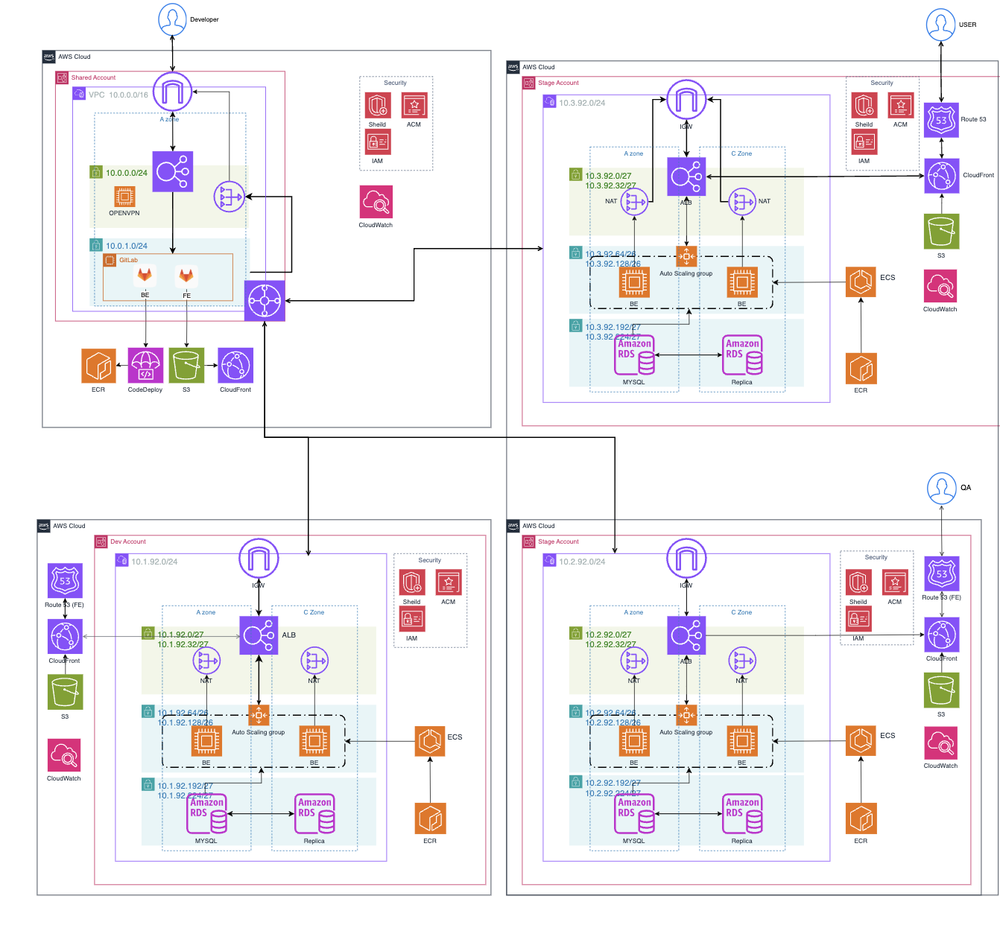

# 🏗️ KTB Terraform 아키텍처 구성

## 📖 개요

이 Terraform 프로젝트는 AWS 인프라를 IaC(Infrastructure as Code) 방식으로 관리하며, **다중 계정 구조**로 설계되어 있습니다.

- **Shared 계정**: 개발 도구, VPN, GitLab 등 공통 인프라
- **Stage 계정**: 스테이징 환경 애플리케이션 인프라 (ECS, ALB, RDS 등)

---

## 🗺️ KTB 전체 아키텍처 다이어그램



## 🧱 인프라 구성 요약

### 🔹 Shared 계정 (CIDR: `10.0.0.0/23`)

- **개발자 접근 인프라**
  - OpenVPN 서버 (Bastion Host)
  - GitLab (Self-hosted)

- **네트워크 구성**
  - VPC: `10.0.0.0/23`
  - 퍼블릭 서브넷: `10.0.0.0/24`
  - 프라이빗 서브넷: `10.0.1.0/24`
  - NAT Gateway, Internet Gateway

- **VPC Peering**: Stage 계정과 연결

---

### 🔹 Stage 계정 (CIDR: `10.3.92.0/24`)

- **컨테이너 기반 애플리케이션**
  - Amazon ECS (EC2 기반)
  - ALB (Application Load Balancer)

- **데이터베이스**
  - Amazon RDS (MySQL)
  - Read Replica 구성

- **네트워크**
  - VPC: `10.3.92.0/24`
  - A/C 가용영역에 퍼블릭 / 서비스 / DB 서브넷 분리
  - NAT, Internet Gateway

- **정적 콘텐츠 및 보안**
  - S3 + CloudFront
  - IAM, AWS Shield, ACM 구성

---

## 📂 디렉토리 구조

```plaintext
├── .github/workflows/
│   └── stage-terraform.yml      # GitHub Actions CI/CD 파이프라인
├── backend/
│   └── backend.tf               # Terraform 상태 관리 설정 (S3, DynamoDB)
├── modules/                     # 공통 모듈
│   ├── alb/                     # ALB 모듈
│   ├── ecs/                     # ECS 서비스 모듈
│   ├── iam/                     # IAM 역할 모듈
│   ├── instance/                # EC2 인스턴스 모듈
│   ├── vpc/                     # VPC 네트워크 모듈
│   └── vpc_peering/             # VPC 피어링 모듈
├── shared/
│   ├── main.tf                  # OpenVPN, GitLab 리소스 정의
│   └── provider.tf              # AWS Provider 설정
└── terraform_stage/
    ├── container_definitions.json
    ├── main.tf                  # VPC, ALB, ECS 리소스 정의
```
## 🔧 주요 모듈 및 리소스

### 1️⃣ VPC 네트워크
- **Shared VPC**: `10.0.0.0/23`
- **Stage VPC**: `10.3.92.0/24`
- **VPC 피어링**으로 두 계정 간 안전한 통신 구성
- **퍼블릭 / 프라이빗 서브넷 구조**

---

### 2️⃣ 공유 인프라 (Shared)
- **OpenVPN 서버**: VPN 기반 접근 제어 (Global Bastion Host 역할)
- **GitLab**: 소스 코드 저장소 및 CI/CD 파이프라인 관리
- **프라이빗 서브넷**에 배치하여 보안 강화

---

### 3️⃣ 컨테이너 환경 (Stage)
- **Amazon ECS (EC2 기반)** 클러스터
- **Auto Scaling Group** 구성으로 탄력적 인스턴스 운영
- **CloudWatch Logs**를 통한 컨테이너 로그 수집

---

### 4️⃣ 로드 밸런싱
- **ALB**를 통해 HTTP/HTTPS 트래픽 라우팅
- **헬스 체크** 기반 트래픽 분산
- **보안 그룹**으로 접근 제어

---

### 5️⃣ CI/CD 파이프라인
- **GitHub Actions** 기반 자동화 배포
- `.github/workflows/stage-terraform.yml` 사용
- 환경별 브랜치 전략: `feature/`, `stage/`, `main`
- **S3 + DynamoDB**를 백엔드로 사용하여 Terraform 상태 관리

---

## 🔐 보안 구성
- **IAM Role 및 Policy**를 통해 최소 권한 원칙 적용
- **보안 그룹** 기반 네트워크 트래픽 제어
- **CloudWatch Logs** 및 감사 추적 활성화
- **VPC 피어링**을 통해 안전한 계정 간 통신

---

## 🚀 배포 프로세스
1. GitHub 저장소에 코드 Push 발생
2. GitHub Actions 워크플로우(`stage-terraform.yml`) 자동 실행
3. `terraform plan → apply` 순으로 인프라 반영
4. 상태 파일은 **S3 + DynamoDB**에 안전하게 저장
5. 워크플로우 디스패치 기능을 통한 **수동 삭제 옵션 제공**

---

## ⚙️ 고가용성 및 확장성
- **다중 가용영역(AZ A, C)** 기반 인프라 구성
- **Auto Scaling**으로 ECS 인스턴스 탄력 운영
- **ALB**를 통한 트래픽 자동 분산 및 장애 복원
- **RDS 읽기 복제본**을 통한 DB 확장성 확보

